# Домашнее задание: «Защита сети»

## Подготовка к выполнению заданий

### Сети
- Ubuntu (жертва): 10.211.55.19  
- Kali (атакующий): 10.211.55.21  
Обе машины находятся в одной подсети `10.211.55.0/24`.

### Скриншоты
1. IP-адреса обеих машин (`ip a`):  
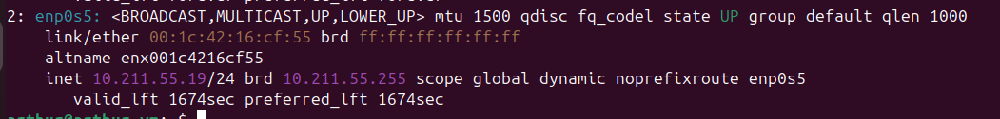  
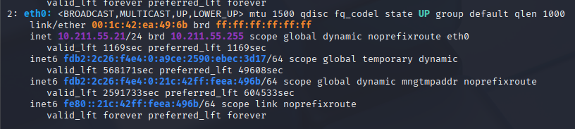

2. Проверка связи (ping):  
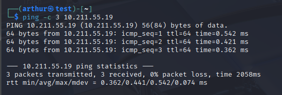  
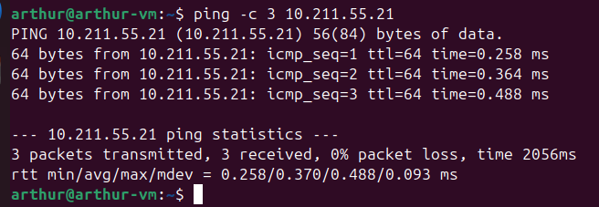

3. Установка и проверка версий Suricata и Fail2Ban (Ubuntu):  
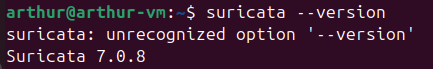  
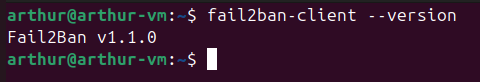

4. Проверка инструментов на Kali (nmap, hydra):  
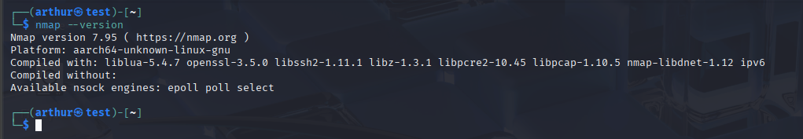  
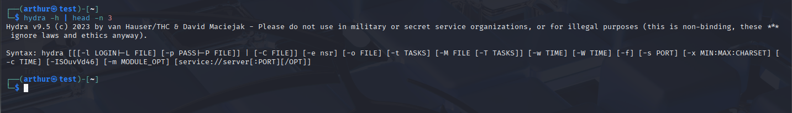


## Задание 1

Разведка `nmap` с Kali по целевому хосту (Ubuntu):

- `sudo nmap -sA 10.211.55.19`
- `sudo nmap -sT 10.211.55.19`
- `sudo nmap -sS 10.211.55.19`
- `sudo nmap -sV 10.211.55.19`

### Результаты сканирования
Открытые порты обнаружены nmap:
- **80/tcp** — HTTP (HAProxy 2.0.0+)
- **3306/tcp** — MySQL 8.0.x

Скрин:  
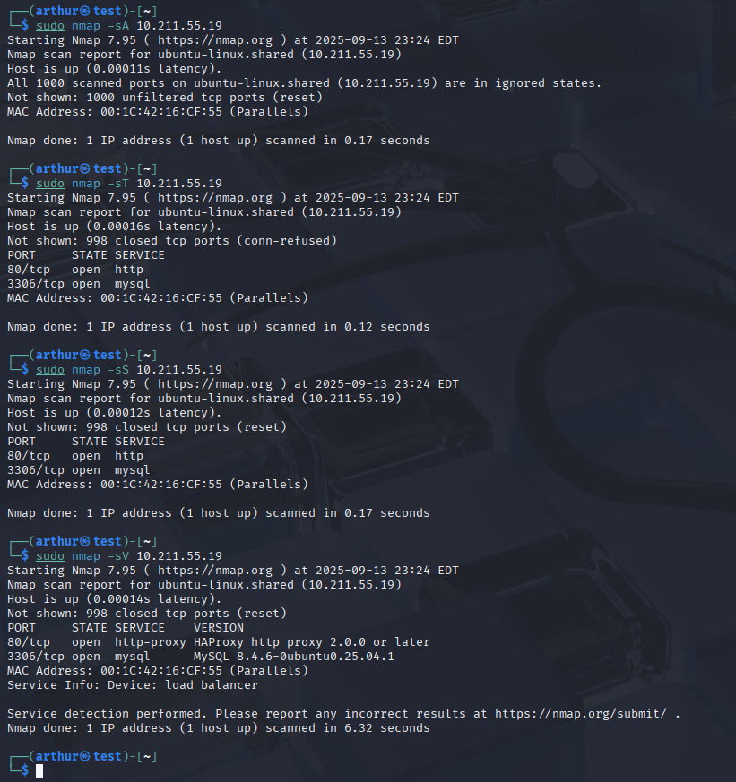

### События в Suricata
Suricata зафиксировала сканирование:
- `ET SCAN Possible Nmap User-Agent Observed`
- `SURICATA AppLayer Mismatch protocol both directions`

Скрин:  
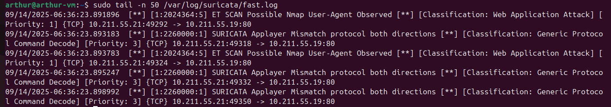

### Fail2Ban
Jail `sshd` активен, блокировок нет (сканирование nmap банов не вызывает).


## Задание 2

### Настройка Fail2Ban

Файл `/etc/fail2ban/jail.conf`, секция `[sshd]` была изменена для включения защиты SSH:

```ini
[sshd]
enabled  = true
port     = ssh
filter   = sshd
logpath  = %(sshd_log)s
backend  = %(sshd_backend)s
maxretry = 3
```

Скриншот изменения конфига Fail2Ban:
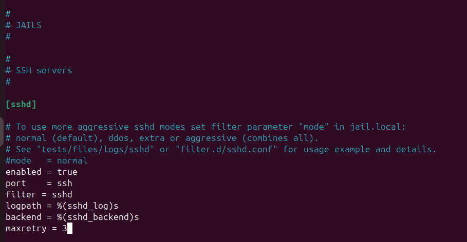

Атака на подбор пароля (hydra)

Созданы тестовые файлы:
	•	users.txt — список пользователей
	•	pass.txt — список паролей

Запуск атаки:
```
hydra -L users.txt -P pass.txt 10.211.55.19 ssh
```
Результат: соединение к порту 22 отклонено (Connection refused), так как служба SSH на целевой системе отключена.

Скриншот атаки hydra:
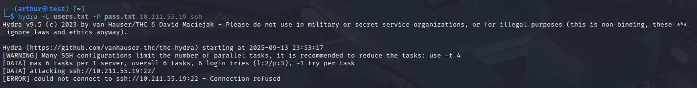

События в Fail2Ban

Проверка статуса jail и логов выполнялась командами:

sudo fail2ban-client status sshd
sudo tail -n 30 /var/log/fail2ban.log

Результат: Jail sshd активен, но блокировок не зафиксировано.

Скриншот статуса и логов Fail2Ban:
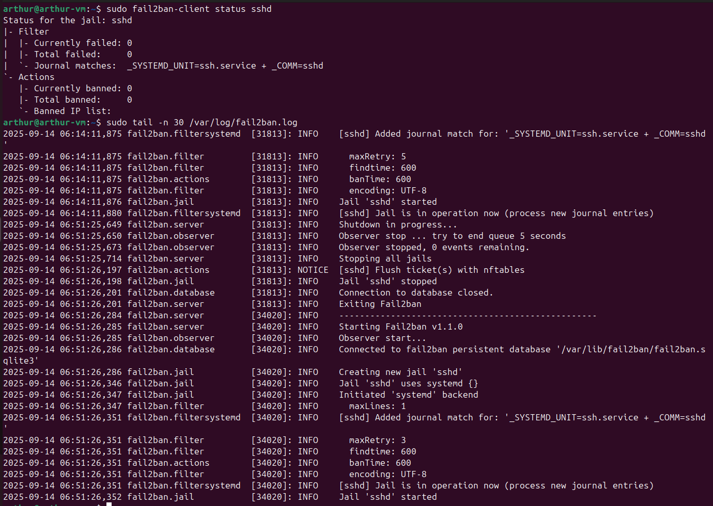

События в Suricata

Проверка логов Suricata:
```
sudo grep -i ssh /var/log/suricata/fast.log | tail -n 20
sudo grep -i ssh /var/log/suricata/eve.json | tail
```
